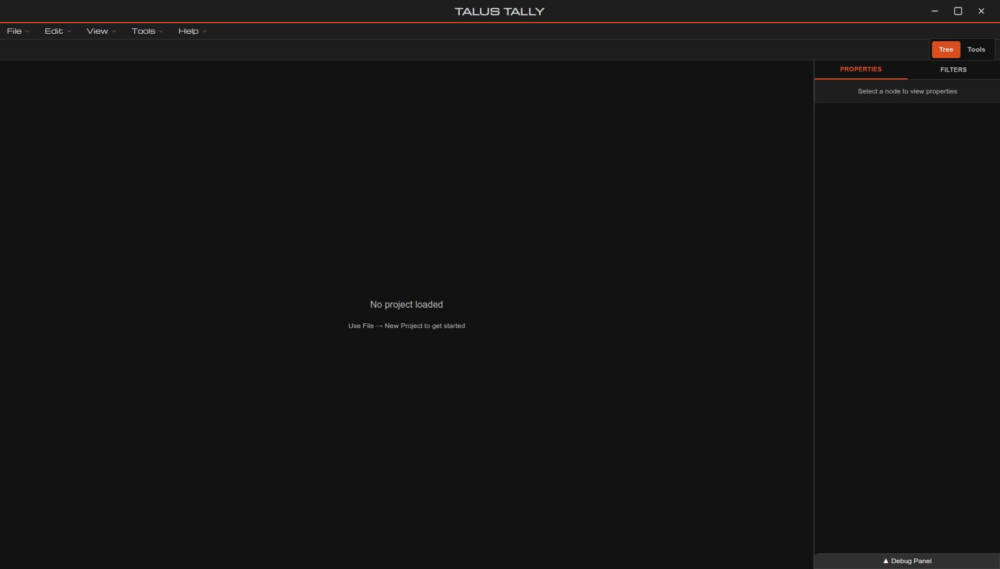
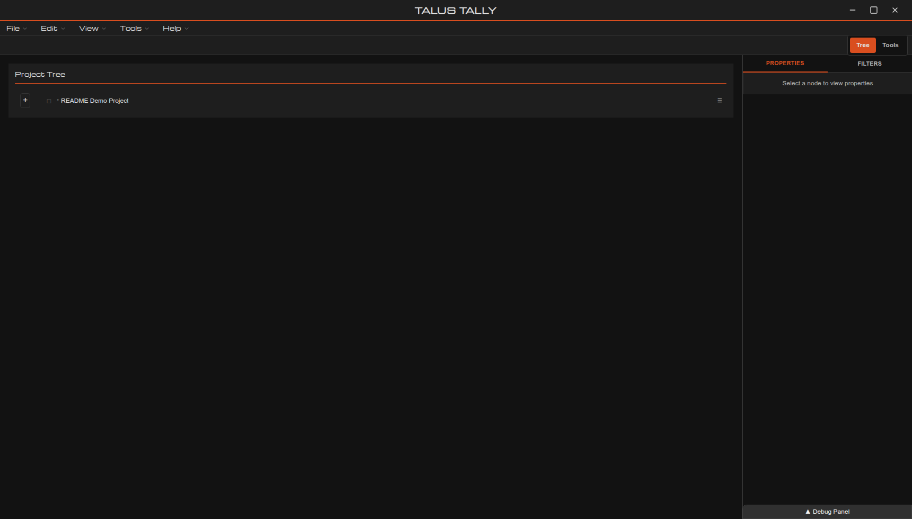
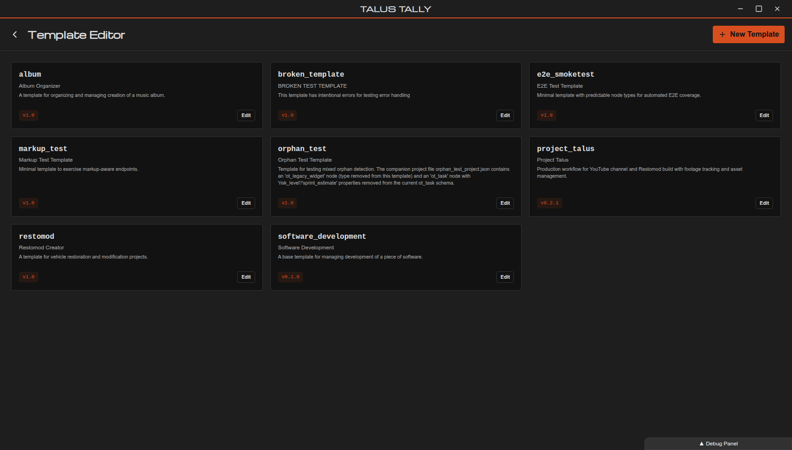

# Talus Tally

**Talus Tally gives technical teams a control tower for complex project execution.**

It is a graph-first project command center for high-dependency, multi-phase work where standard task boards lose critical context.

---

## Why Talus Tally

Most project tools are optimized for lightweight task tracking. Talus Tally is designed for operational complexity:

- **System-level visibility** with dependency-aware graph hierarchy
- **Operational clarity** from unified context, status signals, and node detail
- **Repeatable delivery** through template-driven schemas
- **Governance-friendly flexibility** through deep properties and customization

If your projects involve many moving parts (phases, teams, blockers, handoffs, assets), Talus Tally is built for that reality.

---

## Screenshots

### Main Workspace



### Project Tree + Property Panel



### Template Editor



---

## What You Can Do Today

- Launch structured initiatives from reusable templates
- Model complex delivery as hierarchical, property-rich nodes
- Keep execution aligned to schema-backed definitions
- Run in a focused standalone desktop environment

---

## Platform Status

### Current

Talus Tally is currently delivered as a **standalone Tauri desktop application** (Linux/macOS/Windows build targets), with a bundled frontend + backend runtime.

This enables immediate team adoption without standing up server infrastructure.

### Roadmap

The long-term direction is a **full web/backend stack for distributed enterprise usage**, including:

- Distributed multi-user workflows
- Corporate-grade deployment and operations
- Cross-team collaboration at enterprise scale

The roadmap preserves Talus Tally's depth while adding centralized deployment and broader collaboration.

In short: **desktop power now, enterprise distribution next.**

---

## Quick Start

### Run Desktop App in Development

```bash
cd frontend
npm install
npm run desktop:dev
```

### Build Installers

From the repository root:

- Linux/Debian: `./build-deb.sh`
- macOS: `./build-macos.sh`
- Windows: `pwsh ./build-windows.ps1`

---

## Documentation

- [Developer Environment Setup](docs/development/DEV_ENVIRONMENT.md)
- [Frontend Quick Start](docs/development/FRONTEND_QUICK_START.md)
- [API Contract](docs/api/API_CONTRACT.md)
- [Integration Guide](docs/guides/INTEGRATION_GUIDE.md)

---

## Ideal Use Cases

Talus Tally is a strong fit for teams managing:

- Product and engineering delivery roadmaps
- Complex build, restoration, or manufacturing workflows
- Multi-phase operational execution with interdependent workstreams
- Any project environment where hierarchy and dependency visibility are critical

---

## Contributing

Issues, ideas, and feedback are welcome. If you are evaluating Talus Tally for serious operational use, open an issue and share your use case.
